> [!NOTE] 
> SLIDES -> https://github.com/alexjust-data/FullStack07_React_app_tweeter_REDUX/blob/main/Redux.pdf
> 
> Teacher :   
> David https://github.com/davidjj76  
> Discord : https://discord.com/channels/1112689497642115172/1112689499605049377
> 
> https://github.com/KeepCodingWeb15/twitter-react/tree/redux  
> https://github.com/KeepCodingWeb15  

Partimos del repositorio de fundamentos React, de la rama creada `redux`

```sh
git clone -b redux https://github.com/KeepCodingWeb15/twitter-react.git
```

Arranco Sparrest

```sh
➜  cd '/Volumes/G-DRIVE with Thunderbolt/BOODCAMP/sparrest.js'
➜  sparrest git:(main) ✗ npm start                                            

> sparrest@1.0.0 start
> node index.js

JSON Server is running on port 8001
```

Arranco la aplicación

```js
npm start

Compiled successfully!

You can now view twitter-react in the browser.

  Local:            http://localhost:3000
  On Your Network:  http://192.168.1.112:3000

Note that the development build is not optimized.
To create a production build, use npm run build.

webpack compiled successfully
```

# Redux

Redux es una biblioteca popular de JavaScript para la gestión del **estado** en aplicaciones web, y es comúnmente utilizada junto con bibliotecas o frameworks como React.

> en el desarrollo de aplicaciones web y móviles, el "estado" es un concepto fundamental que se refiere a la información o los datos que una aplicación mantiene en un momento dado. El estado puede cambiar a lo largo del tiempo en respuesta a las acciones del usuario o a otros eventos.
> 
> **Características del Estado en una Aplicación**
> 
> * **Dinámico**: El estado puede cambiar a lo largo del tiempo. Por ejemplo, el estado de una aplicación puede cambiar cuando un usuario llena un formulario, cuando se reciben datos de una API, o cuando el usuario interactúa con la interfaz.
> * **Local o Global**: El estado puede ser local (limitado a un componente o parte específica de la aplicación) o global (disponible en toda la aplicación). En el contexto de React, por ejemplo, un estado local se maneja generalmente dentro de un componente, mientras que un estado global puede ser manejado por contextos o bibliotecas como Redux.
> * **Persistente o Efímero**: Algunos estados son persistentes, lo que significa que se guardan y se mantienen incluso después de cerrar la aplicación, como los datos de usuario guardados en una base de datos o almacenamiento local. Otros estados son efímeros y solo existen mientras la aplicación está activa, como el estado de un formulario antes de enviarlo.
>
>**Ejemplos de Estado en una Aplicación**
>
> * **Estado de la Interfaz de Usuario**: Por ejemplo, si un menú está abierto o cerrado, si un modal está activo, el valor actual de un campo de texto, etc.
> * **Datos del Usuario**: Información sobre el usuario actual, como sus preferencias, configuración, o estado de autenticación.
>
> * **Datos de la Aplicación**: Cualquier dato que la aplicación necesita para funcionar, como los resultados de una llamada a una API, una lista de elementos de un carrito de compras, etc.
>
>Gestión del Estado
>La gestión del estado es un aspecto crucial del desarrollo de aplicaciones, ya que determina cómo se comporta una aplicación en respuesta a diversas entradas y eventos. Las aplicaciones modernas utilizan varios enfoques y herramientas para manejar el estado de manera eficiente y efectiva, tales como useState en React, Vuex en Vue.js, o NgRx en Angular.


**¿Qué es Redux?**

Redux proporciona una forma de centralizar el estado y la lógica de una aplicación, lo que facilita el rastreo y la manipulación del estado a lo largo de toda la aplicación. En una aplicación de React sin Redux, el estado se gestiona típicamente en los componentes individuales, lo que puede llevar a una gestión del estado dispersa y complicada, especialmente en aplicaciones grandes y complejas.

¿Qué aporta Redux en proyectos de React?

1. **Gestión del Estado Predecible**: Redux ayuda a mantener el estado de tu aplicación en un solo lugar (el "store") y controla cómo ese estado se actualiza a lo largo del tiempo, haciendo que el estado de tu aplicación sea más predecible.
2. **Mantenibilidad Mejorada**: Al centralizar el estado y la lógica de la aplicación, Redux hace que el código sea más fácil de mantener. Los desarrolladores saben dónde encontrar y cómo modificar el estado de la aplicación.
3. **Depuración Más Fácil**: Redux ofrece herramientas poderosas para la depuración, como la habilidad de rastrear cada cambio en el estado a través de "acciones" y "reducers". Esto hace que sea más fácil entender cómo y cuándo cambió el estado.
4. **Persistencia del Estado y SSR**: Facilita la implementación de funcionalidades como la persistencia del estado (guardar el estado en el almacenamiento local del navegador) y el renderizado del lado del servidor (Server-Side Rendering, SSR), lo que puede ser complejo de manejar en aplicaciones grandes.
5. **Desacoplamiento de la Lógica de Estado**: Permite separar la lógica del estado y la UI, lo que puede llevar a un diseño de aplicación más claro y a una mejor separación de preocupaciones.
6. **Ecosistema y Comunidad**: Redux tiene un gran ecosistema y comunidad, con muchas bibliotecas y herramientas complementarias que pueden ayudar a resolver problemas comunes de manera eficiente.
7. **Facilita la Colaboración**: Al tener un enfoque estandarizado para manejar el estado, facilita la colaboración entre desarrolladores en un proyecto.

Consideraciones

* **Complejidad Adicional**: Para proyectos pequeños o simples, Redux puede ser excesivo y añadir una complejidad innecesaria.
* **Curva de Aprendizaje**: Aprender Redux lleva tiempo, especialmente para entender conceptos como reducers, middleware, store, acciones, etc.
* **Alternativas**: Con las recientes actualizaciones en React (como Context API y Hooks), algunas aplicaciones pueden no necesitar Redux para una gestión eficiente del estado. Sin embargo, Redux sigue siendo una opción sólida para aplicaciones complejas y de gran escala.


Instalemos esta extension en el navegador:

https://chromewebstore.google.com/detail/redux-devtools/lmhkpmbekcpmknklioeibfkpmmfibljd

INstalamos Redus

```sh
npm install redux --save
```

Creo carpeta `scr/store/index.js`

```js
import { createStore } from 'redux';         // nos permite crear un almacenredux

const reducer = (state = 0, action) => {     // función q decide como aplicar los cambios de estado
  // implement state logic                   // recibo valor del estado y la acción
  switch (action.type) {
    case 'increment':
      return state + 1;
    case 'decrement':
      return state - 1;
    default:
      return state;
  }
};

const store = createStore(reducer);           // nos creamos el almacen

console.log({store}); // vamos a ver que tiene
```

Voy al `index.js` y lo importo `import './store'; `

Por consola la aplicacoin nos enseña que es `store`

```sh
store: 
    @@observable: ƒ observable()
    dispatch:ƒ dispatch(action)
    getState: ƒ getState()
    replaceReducer: ƒ replaceReducer(nextReducer)
    subscribe: ƒ subscribe(listener)
    [[Prototype]]: Object
    [[Prototype]]: Object
```

Es un objeto con tres métodos `getState()` , `subscribe(listener)` , `dispatch(action)`

```js
import { createStore } from 'redux';

const reducer = (state = 0, action) => {
  // implement state logic
  switch (action.type) {
    case 'increment':
      return state + 1;
    case 'decrement':
      return state - 1;
    default:
      return state;
  }
};

const store = createStore(reducer);

// cada vez que se produzco un cambio deribado de una accion ejecuta esta función
const callback = () => console.log('state', store.getState());
store.subscribe(callback); // me suscribo "acuerdate de llamarme cuando tengas un cambio"
callback();                // lanzo callback para ver mi estado por consola 'state 0'

store.dispatch({ type: 'increment' }); // ejecuto accion de incremento state 1
store.dispatch({ type: 'decrement' }); // ejecuto accion de decremento state 0
```

## Creando nuestro propio **createStore**

Es una funcion que devuelve tres métodos `getState()` , `subscribe(listener)` , `dispatch(action)`

```js
// import { createStore } from 'redux';

function createStore(reducer) {
  let state;                        // almacenamos el estado
  let listeners = [];               // cada vez que se suscriban guardamos

  function getState() {             // simplememntodevuelve el valor del estado
    return state;
  }

  function dispatch(action) {       
    state = reducer(state, action); // la logica está en reducer, sabe qué hacer con state y la accion
    listeners.forEach(l => l());    // por cada elemento lo ejecuta l()
  }

  function subscribe(listener) {    
    listeners.push(listener);       // almacenamos en el array

    return function () {            // filtra todos los listeners menos el que te he enviado
      listeners = listeners.filter(l => !listener);
    };
  }

  dispatch({ type: 'initialization' }); // ará que se ejecuten las funciones

  return {
    getState,
    subscribe,
    dispatch,
  };
}


const reducer = (state = 0, action) => {
  // implement state logic
  switch (action.type) {
    case 'increment':
      return state + 1;
    case 'decrement':
      return state - 1;
    default:
      return state;
  }
};

const store = createStore(reducer);

const callback = () => console.log('state', store.getState());
const unsubscribe = store.subscribe(callback);
callback();

store.dispatch({ type: 'increment' });

unsubscribe();
store.dispatch({ type: 'decrement' });
console.log(store.getState());
```

## Conceptos básicos

**Acciones**

Objetos que representan una intención de cambiar el estado
* Se definen con una propiedad obligatoria type que identifica el tipo de acción
* Pueden contener otros datos que describen completamente la acción (payload)
* Es buena práctica definir los distintos types como constantes, incluso ponerlos en un fichero aparte

Actions creators

Funciones que crean y devuelven acciones:
* Acciones reusables
* Fácilmente testeables
* Mediante middleware, pueden devolver funciones, acceder al estado, ejecutar side-effects (asincronía)…

https://github.com/redux-utilities/flux-standard-action

**Estado**

Lo que no vemos.

El estado puede tener cualquier forma, es responsabilidad nuestra modelar el estado para que se ajuste a la aplicación. Puede ser:
* Un dato primitivo: Number, String, Boolean
* Un Array, Object, o cualquier estructura **serializable** (que puedes enviarlo como objeto string sin perdidas)

**Reducers**

Maneja la logica centrol del estado

Especifican cómo cambia el estado en respuesta a las acciones enviadas al store

* (previousState, action) => newState
* Debe ser una función pura, por lo que no pueden, bajo ningún concepto:
* Mutar sus argumentos
* Ejecutar side-effects (API, BBDD, DOM…)
* Llamar funciones no puras Date.now(), Math.random()
* Fácilmente testeables y predecibles, ya que, a igual estado y acción, siempre generan el mismo estado


**Store**

* Objeto core de Redux, enlaza acciones con reducers
* Guarda el estado de la aplicación
* Permite el acceso al estado con store.getState()
* Permite despachar acciones con store.dispatch(action)
* Registra y mantiene subscripciones con store.subscribe()
* Una vez definido el reducer, crear el store es tan sencillo

**Flujo de datos**

En Redux el flujo de datos es unidireccional
1. Se despacha una acción: store.dispatch(action)
2. El store llama al reducer pasándole el estado y la acción
3. El reducer principal combina el resultado de los diferentes reducers, produciendo el nuevo estado
4. Redux almacena el nuevo estado y llama a los subscriptores para que puedan consultar el valor


> [!IMPORTANT]
> Comenzamos a picar código

Lo primero es pensar qué es lo que queremos almacenar en Redux.
Estructurar el estado
Qué acciones manejar en el estado.

Renombro `store/index.js` -> `index-poc.js`.  
Quito del `index.js` el `import './store'; `

Ahora en `store` vamos a crear varios ficheros:
* actions.js
* types.js
* reducers.js
* index.js (donde almacenamos el store)


Pensemos como queramos el estado: `store/reducers.js`

```js
// mi estado tendrá esta forma
const defaultState = {
  auth: false,
  tweets: [],
};

// defino el reducer
export default function reducer(state = defaultState, action) {
  // ¿qué acciones tiene que tener nuestro estado?
  // acciones que tengan que ver si el usuario está loguado o no
  switch (action.type) {
    case AUTH_LOGIN:            // si está logueado

    case AUTH_LOGOUT:           // si está deslogueado

    case TWEETS_LOADED:         // cargados los tweets

    case TWEETS_CREATED:        // creados los tweets

    default:                    // siempre el eestado por defecto
      return state;
  }
}
```

Voy a `store/types.js` y exporto las acciones

```js
export const AUTH_LOGIN = 'auth/login';
export const AUTH_LOGOUT = 'auth/logout';

export const TWEETS_LOADED = 'tweets/loaded';
export const TWEETS_CREATED = 'tweets/created';
```

```js
import { AUTH_LOGIN, AUTH_LOGOUT, TWEETS_CREATED, TWEETS_LOADED,} from './types';

const defaultState = {
  auth: false,
  tweets: [],
};

export default function reducer(state = defaultState, action) {
  switch (action.type) {
    case AUTH_LOGIN:
      return {
        ...state,    // devuelve nuevo objeto con forma que tenga "defaultState" en ese monento
        auth: true,  // sobreescribo auth
      };
    case AUTH_LOGOUT:
      return {
        ...state,
        auth: false,
      };
    case TWEETS_LOADED:
      return {
        ...state,
        tweets: action.payload, // coje los tweets que te envie y los pones dentro del array
      };

    case TWEETS_CREATED:
    default:
      return state;
  }
}
```

Ahora hemos de ser capaces de despachar estos stores, es decir vamos a crear creadores de acciones.

`actions.js` con `type` estas acciones quedan definidas.

```js
import { AUTH_LOGIN, AUTH_LOGOUT, TWEETS_LOADED } from './types';

export const authLogin = () => ({
  type: AUTH_LOGIN,
});

export const authLogout = () => ({
  type: AUTH_LOGOUT,
});

export const tweetsLoaded = tweets => ({
  type: TWEETS_LOADED,
  payload: tweets,    // hemos dicho que le llgará un payload con los tweets que ha de almacenar
});
```

Fíjate que los tres files tienes que cuadrar, es un contrato entre los tres. Es la base.

Ahora creamos nuesto store `store/index.js`

```js
import { createStore } from 'redux';
import reducer from './reducers';


export default function configureStore() {
  const store = createStore(reducer);
  return store;
}
```

En el indice de la aplicacion `index.js` --> `import configureStore from './store';`

Con esto ya tenemos configurado el store, para verlo la mejor manera es is a las `devTools` para hacer esto hay varias maneras 

https://github.com/reduxjs/redux-devtools

Una vez instalada la extension, verás que te permite pasar más parámetros, para configurarlo puedes introducir esta linea https://github.com/reduxjs/redux-devtools/tree/main/extension#1-with-redux 

Entonces vamos a `store/index.js` y se la ponemos

```js
import { createStore } from 'redux';
import reducer from './reducers';


export default function configureStore() {
  const store = createStore(
    reducer,
    window.__REDUX_DEVTOOLS_EXTENSION__ &&
      window.__REDUX_DEVTOOLS_EXTENSION__(),
  );
  return store;
}
```

Pero hay ora forma de instalarlo 

https://github.com/reduxjs/redux-devtools/tree/main/extension#13-use-redux-devtoolsextension-package-from-npm

`npm install --save @redux-devtools/extension`

```js
import { createStore } from 'redux';

import reducer from './reducers';
import { devToolsEnhancer } from '@redux-devtools/extension';
import * as actionCreators from './actions';

export default function configureStore() {
  const store = createStore(
    reducer,
    devToolsEnhancer({ actionCreators }),
    // window.__REDUX_DEVTOOLS_EXTENSION__ &&
    //   window.__REDUX_DEVTOOLS_EXTENSION__(),
  );
  return store;
}
```


Voy a intentar separar por partes en `Reducer` y conbinarlas luego. independientemente de la accion tenemos que tener claro que mi reducer ha de devolver un objeto que me devuelve un auth y un tweets.

Lo vamos hacer en funciones más pequeñas.

```js
// import combineReducers from 'redux';

import {
  AUTH_LOGIN,
  AUTH_LOGOUT,
  TWEETS_CREATED,
  TWEETS_LOADED,
} from './types';

const defaultState = {
  auth: false,
  tweets: [],
};


export function auth(state = defaultState.auth, action) {
  switch (action.type) {
    case AUTH_LOGIN:
      return true;
    case AUTH_LOGOUT:
      return false;
    default:
      return state;
  }
}

export function tweets(state = defaultState.tweets, action) {
  switch (action.type) {
    case TWEETS_LOADED:
      return action.payload;

    case TWEETS_CREATED:
    default:
      return state;
  }
}

// export default combineReducers({ auth, tweets });

```

`combineReducers` es una funcion de `Redux` que me permite combinar 

me voy a `index.js` e importo `reducers` (auth() y sweet()) y lo combino aquí dentro

```js
import { createStore, combineReducers } from 'redux';

import * as reducers from './reducers';
import { devToolsEnhancer } from '@redux-devtools/extension';
import * as actionCreators from './actions';

export default function configureStore() {
  const store = createStore(
    combineReducers(reducers),
    devToolsEnhancer({ actionCreators }),
    // window.__REDUX_DEVTOOLS_EXTENSION__ &&
    //   window.__REDUX_DEVTOOLS_EXTENSION__(),
  );
  return store;
}
```

> [!NOTE]
> Seguimos ....

Vamos a ver como integramos el `store` de `index.js` con redux en React

```js
import configureStore from './store';
const store = configureStore();
```

Para eso tenemos la librería `react-redux`,  proporciona una forma de conectar componentes de React con un almacén Redux, facilitando la gestión del estado en aplicaciones React. Permite que los componentes accedan al estado de Redux y desencadenen acciones para actualizar ese estado.

```sh
npm i --save react-redux
```
Envielve la palicacion con este componente `<Provider />`   
`connect()` es una funcion que te permite envolver componentes  

Básicamente hará esto:

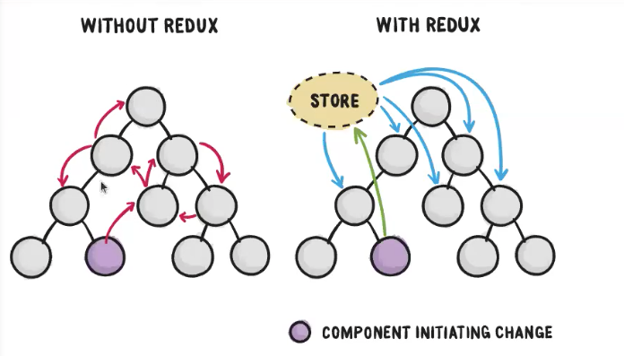

---
### **1er paso: importar el Provider y pasarle el store**

Lo primero es utilizar el `<Provider />` envolviendo toda la aplicacion para que tengan acceso. Vamos al fichero princial de la app `index.js`

```js
import configureStore from './store';
import { Provider } from 'react-redux'; // importo libreria
const store = configureStore(); // <Provider store={store}>

const accessToken = storage.get('auth');
if (accessToken) {
  setAuthorizationHeader(accessToken);
}

const root = ReactDOM.createRoot(document.getElementById('root'));
root.render(
  <React.StrictMode>
    <ErrorBoundary>
      <Provider store={store}>
        <BrowserRouter>
          <AuthContextProvider initiallyLogged={!!accessToken}>
            <App />
          </AuthContextProvider>
        </BrowserRouter>
      </Provider>
    </ErrorBoundary>
  </React.StrictMode>,
);
``` 

Nosmalmente me creo un componete `Root` para ordenar todo y meterme estos Providers, a la larga me irá bien crearme un componenete que tenga tanto el `</Provider>` como el `</BrowserRouter>`

Me creo `src/Root.js`

```js
import { Provider } from 'react-redux';
import { BrowserRouter } from 'react-router-dom';

export default function Root({ store, children }) {
  return (
    <Provider store={store}>
      <BrowserRouter>{children}</BrowserRouter>
    </Provider>
  );
}
```

Ahora tenemos en `index`

```js
import React from 'react';
import ReactDOM from 'react-dom/client';

import './index.css';
import App from './App';
import storage from './utils/storage';
import { setAuthorizationHeader } from './api/client';
import { AuthContextProvider } from './pages/auth/context';
import ErrorBoundary from './components/errors/ErrorBoundary';

import configureStore from './store';
import Root from './Root';

const store = configureStore();

const accessToken = storage.get('auth');
if (accessToken) {
  setAuthorizationHeader(accessToken);
}

const root = ReactDOM.createRoot(document.getElementById('root'));
root.render(
  <React.StrictMode>
    <ErrorBoundary>
      <Root store={store}>
        <AuthContextProvider initiallyLogged={!!accessToken}>
          <App />
        </AuthContextProvider>
      </Root>
    </ErrorBoundary>
  </React.StrictMode>,
);
``` 
 con esto básicamente lo que le estamos diciendo es que todo lo que esté dentro que básicamente es el `App` va a tener acceso a `store`.

---

Acuérdate ahora que esto, el `accessToken` en el `index.js`...

```js
const accessToken = storage.get('auth');
if (accessToken) {
  setAuthorizationHeader(accessToken);
}
``` 

lo utilizábamos para persistir el token en el logout storage para que si cerraba la pestaña dijera que tiene token e igualmente estaba autenticado, y entonces el `initiallyLogged` del `<AuthContextProvider initiallyLogged={!!accessToken}>` lo pongo en TRUE o FALSE en función de eso. Pero ahora realmente este TRUE o FALSE ya no va a vivir en este componente, ya no va a vivir en nuestro estado local, va a vivir en nuestro `store` de `const store = configureStore();`. POr lo tanto a `configureStore()` le vamos a pasar un valor que ons diga si inicalmente esoty logueado o no.

```js
const store = configureStore({ auth: !!accessToken });
```

Entonces recibimos este objeto de configuración en su function correspondiente en el `index` y lo pasamos en `createStore()` como segundo parámetro

```js
export default function configureStore(preloadedState) {
  const store = createStore(
    combineReducers(reducers), //1er parámetro el reducers
    preloadedState,            //2do puede ir o no el preloadedState
    devToolsEnhancer({ actionCreators }), // los mejoradores del store
  );
  return store;
}
```

> [!NOTE]
> Acuérdate que inicalmente cuando configuramos nuestro propio **CreateState** es lo mismo que si yo lo configuraba pasándole al state el preloaded , así `index-poc`
```js
function createStore(reducer, preloadedState) {
  let state = preloadedState;
  let listeners = [];

  ...
```
---

Entonces ya tengo la capacidad de leer de mi local storage y configurar el estado de inicio con lo que yo haya leído.

```js
const accessToken = storage.get('auth');
if (accessToken) {
  setAuthorizationHeader(accessToken);
}

const store = configureStore({ auth: !!accessToken });
```

Ahora si te vas al browser de la app verás que no tienes token, pero si te creas uno nuevo inventado

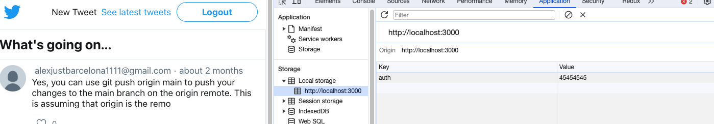

verás que en la extension de Redux y recargas la aplicacino tienes `auth: true,`

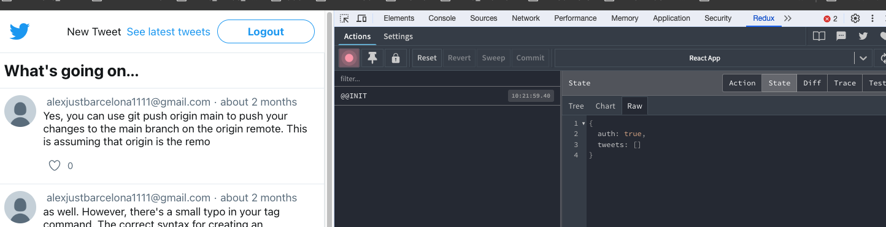

Es exactamente la misma folosofía de antes cuando iniciábamos el estado de login pero lo hacemos a traves de este parámetro `preloadedState`.

---

### **2do paso : Despachando acciones**

**Despacharemos el login**

Recordando lo secuencia del login lo que hacía era en `loginPage.js` hacia en `handleSubmit` un `submit` con las credenciales

```js
  const handleSubmit = async event => {
    event.preventDefault();

    try {
      setIsFeching(true);
      await login(credentials); // hace petición al servicio 
      setIsFeching(false);      // cuando se resuelve 
      onLogin();                // llamamos al onLogin()
```

Este `onLogin()` básicamente es el que venía de `constext.js` donde cambiaba el estado en `AuthContextProvider`

```js
export const AuthContextProvider = ({ initiallyLogged, children }) => {
  const [isLogged, setIsLogged] = useState(initiallyLogged);

  const authHandlers = useMemo(
    () => ({
      onLogin: () => setIsLogged(true), 
      onLogout: () => setIsLogged(false),
    }),
    [],
  );
```

Si yo en vez de llamar a `onLogin();` en `handleSubmit` llamo a un `dispach` de login lo que hago es hacer que cuando se cambie el login seré capaz de cambiar el estado con Redux y cuanod se produzca el logout seré de cambiarlo de nuevo.

Vamos al lío...

Para enganchar un componente necesito tener acceso al dispach dentro del componente para ello redux tinene un hoo `useDespatch()`

`LoginPage.js` añado 

```js
import { useDispatch } from 'react-redux';
import { authLogin } from '../../../store/actions';
... 

function LoginPage() {
  const dispatch = useDispatch();
  //const { onLogin } = useAuthHandlers(); // ya no lo necesito
  ... 

  const onLogin = () => {  // me creo esta funcion para sustituir la implementacion
    dispatch(authLogin());
  };
```

entonces este ` dispatch(authLogin());` va a generar la accion llamando a `store/action.js` en la linea 

```js
export const authLogin = () => ({
  type: AUTH_LOGIN,
});
```

esto genera la accion y se la paso a dispatch que me lo da useDispatch(); y `useDispatch();` básicamente lo que hace es conectarse en el contexto donde hemos puesto el store en `Root` en `<Provider store={store}>` lo que hace `Provider` es establecer un contexto y a través de `useDispatch();` se contecta a este contexto y coge el método dispatch.

```js
export default function Root({ store, children }) {
  return (
    <Provider store={store}>
```

Ya tenemos el método del login, en vez de cambiar el estado local, lo que hará será cambiar el estado de login. Ahora vete a la app y haz un login. Te va a disparar la acción.


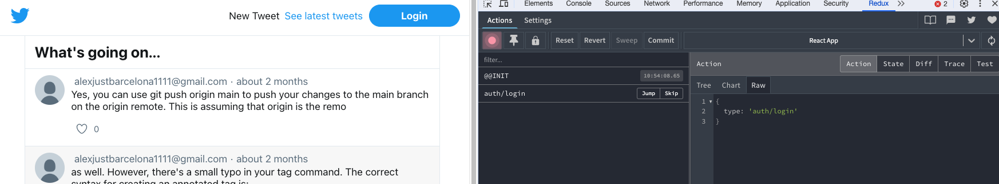

Además tienes tu token real

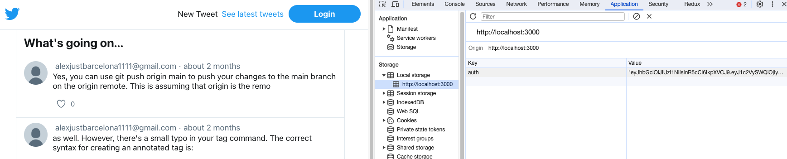


No está navegando pero ya vemos al menos que se despacha. Vamos a por Logout

Teníamos el `Button` en `page/auth/components/AuthButton.js` y lo que hacía era llamar a `useAuthHandlers()` para traérselo a `onLogout` a través del contexto

```js
function AuthButton({ className }) {
  const isLogged = useIsLogged();
  const { onLogout } = useAuthHandlers();

  const handleLogoutClick = async () => {
    await logout();
    onLogout();
  };
  return isLogged ? (
    <Button onClick={handleLogoutClick} className={className}>
      Logout
    </Button>
  ) : (
    <Button as={Link} to="/login" $variant="primary" className={className}>
      Login
    </Button>
  );
}
```

Pues esto lo vamos a cambiar por un `dispatch`

```js
import { Link } from 'react-router-dom';
import Button from '../../../components/shared/Button';
import { useIsLogged } from '../context';
import { logout } from '../service';
import { useDispatch } from 'react-redux';
import { authLogout } from '../../../store/actions';


function AuthButton({ className }) {
  const dispatch = useDispatch();
  const isLogged = useIsLogged();

  const onLogout = () => {
    dispatch(authLogout());
  };

  const handleLogoutClick = async () => {
    await logout();
    onLogout();
  };
  return isLogged ? (
    <Button onClick={handleLogoutClick} className={className}>
      Logout
    </Button>
  ) : (
    <Button as={Link} to="/login" $variant="primary" className={className}>
      Login
    </Button>
  );
}

export default AuthButton;
```

Ahora si te vas a la app hacer un logout lo tendrás en la extension de redux

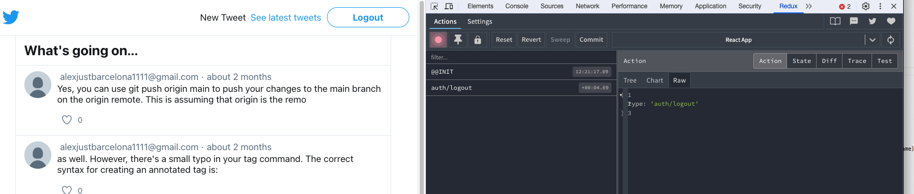

--- 

### **3er paso : selectores** 

Cómo acceder a los componentes no para despacharlos si no para traernos la información que nos interese.

* `connect` : Es una función de orden superior que conecta componentes de React con el store de Redux. Permite acceder al estado y despachar acciones. Se usa principalmente en componentes de clase.. Conecta el componente con el store de Redux. Sirve tanto para traer informacion como apra despacher acciones.
  
* `useSelector` : Es un hook de React-Redux utilizado en componentes funcionales para seleccionar datos del store de Redux. Es más simple y directo comparado con connect y es la forma recomendada de acceder al estado en componentes funcionales.


Vamos a poner un ejemplo de connect. Imagínate que no estás usando `useDispatch();` en el propio `AuthButton`

```js
function AuthButton({ className }) {
  // const dispatch = useDispatch();
  const isLogged = useIsLogged();

  // const onLogout = () => {
  //   dispatch(authLogout());
  // };
```

Entonces lo que haremos será conectarl el `logout` con connect sólamente para poder inyectar una propiedad que será una función similar a esta:

```js
  // const onLogout = () => {
  //   dispatch(authLogout());
  // };
```

Que cuando se ejecute hará el dispatch de la funcion que le digaoms, la forma de uso de connect es mediante 

* 1ra llmada para cofigurar : `connect(mapDispatchToProps, mapDispatchToProps)`
* 2da llamada para envolver el componente : `connect()(AuthButton);`
---
* `mapStateToProps`: extrae datos del estado
* `mapDispatchToProps`: crea funciones que despachan acciones
* `connect()(Component)`: pasa la función dispatch como prop

Vamos a ver `mapDispatchToProps`  en el propio `AuthButton`

```js
export default connect(null, mapDispatchToProps)(AuthButton);
```

Creamos la funcion 

```js
const mapDispatchToProps = {
  onLogout: authLogout,
};

// se la pasamos 
export default connect(null, mapDispatchToProps)(AuthButton);
``` 

Para que conecte con `(AuthButton)` se la hemos le hemos de pasar el dato de `onLogout` como atributo.

```js
import { Link } from 'react-router-dom';
import { connect, useDispatch } from 'react-redux';
import Button from '../../../components/shared/Button';
import { useIsLogged } from '../context';
import { logout } from '../service';
import { authLogout } from '../../../store/actions';


function AuthButton({ className, onLogout }) {
  // const dispatch = useDispatch();
  const isLogged = useIsLogged();

  // const onLogout = () => {
  //   dispatch(authLogout());
  // };

  const handleLogoutClick = async () => {
    await logout();
    onLogout();
  };
  return isLogged ? (
    <Button onClick={handleLogoutClick} className={className}>
      Logout
    </Button>
  ) : (
    <Button as={Link} to="/login" $variant="primary" className={className}>
      Login
    </Button>
  );
}

const mapDispatchToProps = {
  onLogout: authLogout,
};

export default connect(null, mapDispatchToProps)(AuthButton);
```

Ahora si te vas a la app y haces un logout verás como redux conecta y dispara el evento

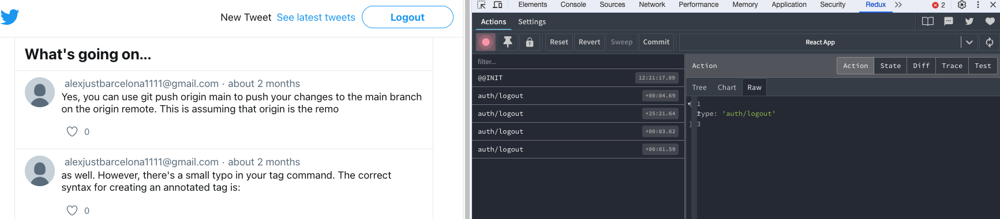

---

Ahora vamos a , mi estado que vivía enteriormente en este CustomHook `const isLogged = useIsLogged();` que lo tenemos en 

`context.js`

```js
const AuthContext = createContext(false);
const AuthContextHandlers = createContext(undefined);

export const useIsLogged = () => {
  const isLogged = useContext(AuthContext);
  return isLogged;
};

export const useAuthHandlers = () => {
  const authHandlers = useContext(AuthContextHandlers);
  return authHandlers;
};

export const AuthContextProvider = ({ initiallyLogged, children }) => {
  const [isLogged, setIsLogged] = useState(initiallyLogged);

  const authHandlers = useMemo(
    () => ({
      onLogin: () => setIsLogged(true),
      onLogout: () => setIsLogged(false),
    }),
    [],
  );

  return (
    <AuthContextHandlers.Provider value={authHandlers}>
      <AuthContext.Provider value={isLogged}>{children}</AuthContext.Provider>
    </AuthContextHandlers.Provider>
  );
};
```
lee el contexto donde tenemos almacenado el estado que almacena el valor de `isLogged`. Pues ahora lo que haremos será cargarnos este estado de aquí y lo llevaremos a Redux.

La manera de leerlo es aprovechar que tengo en `AuthButton.js` el `useIsLogged` y hacer una búsqueda por la app para ver donde modificar, y si lo buscas verás que lo tenemos en `AuthButton` que es el botón para hacer logout; y luego lo tenemos en `RequireAuth.js` que es el componente que protege nuestra ruta para en caso de que to quisiera acceder a un elemento que estaba protegida bajo autentificación enviarlo de vuelta al login. 

¿cómo se lee la informacion en Redux?

* `useSelector` : usada en un componente permite extraer datos de un store redux, usando un selector

Si yo quiero connectar mi componente `RequireAuth` para que lea el estado `isLogged` desde Redux aquí 

```js
import { Navigate, useLocation } from 'react-router';
import { useIsLogged } from '../context';

function RequireAuth({ children }) {
  const location = useLocation();
  const isLogged = useIsLogged();

  return isLogged ? (
    children
  ) : (
    <Navigate to="/login" state={{ from: location }} />
  );
}

export default RequireAuth;
```

lo que tenemos que hacer es esto:

```js
import { useSelector } from 'react-redux';
import { Navigate, useLocation } from 'react-router';
// import { useIsLogged } from '../context';

function RequireAuth({ children }) {
  const location = useLocation();
  // const isLogged = useIsLogged();
  const isLogged = useSelector(state => state.auth);

  return isLogged ? (
    children
  ) : (
    <Navigate to="/login" state={{ from: location }} />
  );
}

export default RequireAuth;
```
Ya tenemos conectado. Y cuando lances una acción se renderizará de nuevo al cambiar el valor de este contexto.

Ahora si te logueas con la app verás que es capaz de redicreccionar 

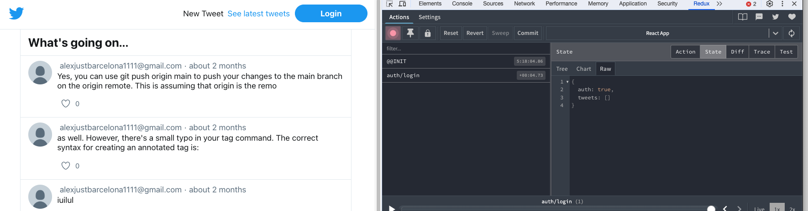

---

> [!NOTE]
> Vamos a seguir con los selectores.  
> Ahora mismo ya tenemos conectado todo lo que tiene que ver con el login que ya se maneja todo con Redux.

Ahora si te fijas en context las funciones que hay ya no se usan, por lo tanto podemos eliminar el archivo. Te dará errores pero con los imports quehas de rectificar. En `index.js` quitamos el componente que ya no usamos `<AuthContextProvider />`

```js
import React from 'react';
import ReactDOM from 'react-dom/client';

import './index.css';
import App from './App';
import storage from './utils/storage';
import { setAuthorizationHeader } from './api/client';
//import { AuthContextProvider } from './pages/auth/context';
import ErrorBoundary from './components/errors/ErrorBoundary';

import configureStore from './store';
import Root from './Root';

const accessToken = storage.get('auth');
if (accessToken) {
  setAuthorizationHeader(accessToken);
}

const store = configureStore({ auth: !!accessToken });

const root = ReactDOM.createRoot(document.getElementById('root'));
root.render(
  <React.StrictMode>
    <ErrorBoundary>
      <Root store={store}>
          <App />
      </Root>
    </ErrorBoundary>
  </React.StrictMode>,
);
```
La app sigue funcionando desde redus y en el browser. Pero podemos ver en Redux que la lista de tweets está vacía `tweets: []`

**Vamos ahora a conectar el listado de tweets**

Vamos al state de `TweetsPage.js` que teníamos este efecto

```js
function TweetsPage() {
  const [tweets, setTweets] = useState([]);

  useEffect(() => {
    getLatestTweets().then(tweets => {
      setTweets(() => {
        return tweets;
      });
    });
  }, []);
```

Y lo que haremos será almacenarlo en Redux. Cuando se resuelva la llamada al Api hacemos un dispatch quedanso así: 

Además hemos de sacar los tweets de Redux ¿como los sacamos de redux? haciendo un `useSelector` 

```js
function TweetsPage() {
  const tweets = useSelector();
  const dispatch = useDispatch();

  useEffect(() => {
    getLatestTweets().then(tweets => {
      dispatch(tweetsLoaded(tweets))
    });
  }, []);
  ...
```
Y me voy a la logica e implemento un selector `store/selector.js`

```js
export const getTweets = state => state.tweets;
```

y se lo enchufo...

```js
function TweetsPage() {
  const tweets = useSelector(getTweets);
  const dispatch = useDispatch();

  useEffect(() => {
    getLatestTweets().then(tweets => {
      dispatch(tweetsLoaded(tweets))
    });
  }, [dispatch]);

  .... 
```
Ya está cargando tweets

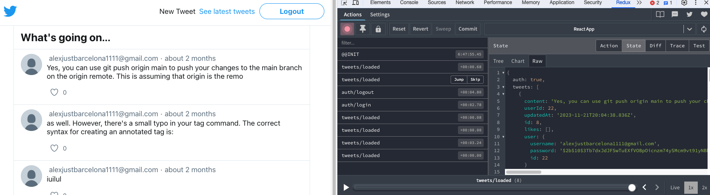


Podríamos utilizar incluso en memoria el listado de tweets, antes los tenía solo en el componente, entonces antes se hacia dificil compartir los tweets entre componentes porque había que hacer peticiones y guardarlos en caché etc

Vamos hacerlo pero no como si siempre fuera bien en una app si no para ver que Redux me permite compartir informacion entre componentes que incluso pueden estar en distints rutas.

1. vamos al detalle que está en el componente `TweetPage.js`

```js
function TweetPage() {
  const params = useParams();
  const navigate = useNavigate();
  const [tweet, setTweet] = useState(null);

  useEffect(() => {
    getTweet(params.tweetId)
      .then(tweet => setTweet(tweet))
      .catch(error => {
        if (error.status === 404) {
          navigate('/404');
        }
      });
  }, [navigate, params.tweetId]);
```

Aquí tenemos una petición que se trae el tweet y lo pone en el stado ... vamos a cambiarlo para que lo saque directamente de Redux.

```js
import { useParams } from 'react-router';
import Content from '../../../components/layout/Content';
import { useSelector } from 'react-redux';

function TweetPage() {
  const params = useParams();

  const tweet = useSelector(); // fíjate que falta pasarle los id de cada anuncnios

  return (
    <Content title="Tweet detail">
      <div>
        Tweet detail {params.tweetId} goes here...
        {tweet && (
          <div>
            <code>{JSON.stringify(tweet)}</code>
          </div>
        )}
      </div>
    </Content>
  );
}

export default TweetPage;
```

Necesito el id de cada twwet entonces en selector le paso la funcion para conseguir esto. El `tweetId` lo que hace es devolver la función que recibe el estado, y esta función que recibe el estado si que se la puedo pasar al `useSelector()`.

```js
// le pasare la funcion : getTweet(params.tweetId)
export const getTweet = tweetId => state =>
  getTweets(state).find(tweet => tweet.id === Number(tweetId));

```

```js
import { useParams } from 'react-router';
import Content from '../../../components/layout/Content';
import { useSelector } from 'react-redux';

function TweetPage() {
  const params = useParams();

  const tweet = useSelector(getTweet(params.tweetId)); // <---- getTweet(params.tweetId)

  return (
    <Content title="Tweet detail">
      <div>
        Tweet detail {params.tweetId} goes here...
        {tweet && (
          <div>
            <code>{JSON.stringify(tweet)}</code>
          </div>
        )}
      </div>
    </Content>
  );
}

export default TweetPage;
```

Ahora si te vas al listado de teewts verás como se carga la peticion 200 

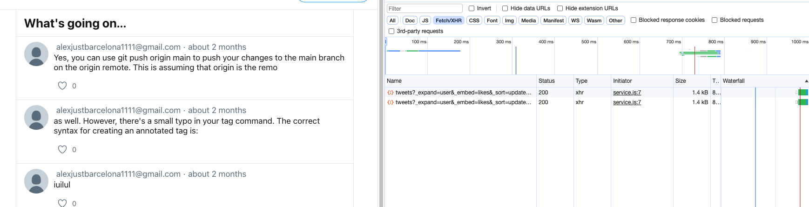

Pero si pinchas al detalle se carga el detalla sin la necesidad de pedirlo de nuevo 

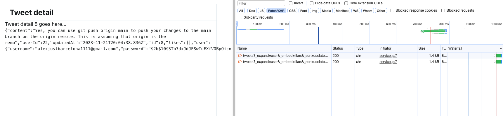

Si te fijas las recargas no funcionan todavía, esto es devido a que al app se reinicia de nuevo, pero si te vas al listado `http://localhost:3000/tweets` lo puedes hacer.


> [!IMPORTANT]
> Al final mi store de Redux es como una caché en el navegador de los datos que tengo de la app , que quiero ir comportiendo de la app


Con esto acabamos con redux, en el sentido de que 
* todas las acciones son Sincronas. No podemos de momento manejar ninguna sincronía.


## Conceptos avanzados

* Funciones asíncronas
* Flujo asíncrono
* Middleware
* Uso con React Router


**Funciones asíncronas**

1. Hasta ahora todas las acciones son síncronas, ¿cómo emitimos acciones asíncronas?
2. En peticiones AJAX a APIs identificamos varios momentos y en cada uno de ellos podemos emitir una acción síncrona
 - El momento de iniciar la petición
 - El momento en que la petición finaliza con éxito
 - El momento en que la petición falla

`store/reducers.js` voy a tener un estado que lo podemos llamar por ejemplo `ui` qu etendrá dos partes `isFetching` que de inicio es false y un `error` 

```js
import {
  AUTH_LOGIN_REQUEST,
  AUTH_LOGIN_SUCCESS,
  AUTH_LOGOUT,
  TWEETS_CREATED,
  TWEETS_LOADED,
  UI_RESET_ERROR,
} from './types';

const defaultState = {
  auth: false,
  tweets: [],
  ui: {
    isFetching: false,
    error: null,
  },
};

... 
```

Entonces cuando yo llame a Login 
* lo primero será despachar a `la acción` que indica que empieza el login; y esa accion lo que hará es poner el `isFetching: true`
* Luego llamaré al servicio, si el servicio va todo correcto, lo que haré será poner `isFetching: false,` y probablemente con el token responder a lo que tuviera que hacer. 
* Y si hay algún error `isFetching: false,` e indicar el error.
  
Y almacenos ese estado en Redux. Y voy a poder conectar mis componentes a redux  para que reaccionen a esos estados.

Cuando nosotros metemos una nueva parte en el estado ¿qué hacemos? crear nuestro `reducer` que maneje esa parte del estado `export function ui(state = defaultState.ui, action) {`

```js
import {
  AUTH_LOGIN_REQUEST,
  AUTH_LOGIN_SUCCESS,
  AUTH_LOGOUT,
  TWEETS_CREATED,
  TWEETS_LOADED,
  UI_RESET_ERROR,
} from './types';

const defaultState = {
  auth: false,
  tweets: [],
  ui: {
    isFetching: false,
    error: null,
  },
};

export function auth(state = defaultState.auth, action) {
}

export function tweets(state = defaultState.tweets, action) {
}

export function ui(state = defaultState.ui, action) {
}
```
Necesitamos crearnos las acciones que pueden crearn este `ui`. Entonces me voy a 

`types.js`

```js
// export const AUTH_LOGIN = 'auth/login';
export const AUTH_LOGIN_REQUEST = 'auth/login/request';
export const AUTH_LOGIN_SUCCESS = 'auth/login/success';
export const AUTH_LOGIN_FAILURE = 'auth/login/failure';

export const UI_RESET_ERROR = 'ui/reset_error';
``` 

```js
export function ui(state = defaultState.ui, action) {
  if (action.error) {
    return { isFetching: false, error: action.payload };
  }

  switch (action.type) {
    case AUTH_LOGIN_REQUEST:
      return { isFetching: true, error: null };

    case AUTH_LOGIN_SUCCESS:
      return { isFetching: false, error: null };

    case UI_RESET_ERROR:
      return { ...state, error: null };

    default:
      return state;
  }
}
```
Fíjate que hemos de cambiar el `export function auth(state = defaultState.auth, action) {` que ahora le pertenece `AUTH_LOGIN_SUCCESS` yo pondré loguado a true si el servicio me responde corectamente nunca antes.

```js
import {
  AUTH_LOGIN_REQUEST,
  AUTH_LOGIN_SUCCESS,
  AUTH_LOGOUT,
  TWEETS_CREATED,
  TWEETS_LOADED,
  UI_RESET_ERROR,
} from './types';

const defaultState = {
  auth: false,
  tweets: [],
  ui: {
    isFetching: false,
    error: null,
  },
};


export function auth(state = defaultState.auth, action) {
  switch (action.type) {
    case AUTH_LOGIN_SUCCESS:
      return true;
    case AUTH_LOGOUT:
      return false;
    default:
      return state;
  }
}

export function tweets(state = defaultState.tweets, action) {
  switch (action.type) {
    case TWEETS_LOADED:
      return action.payload;

    case TWEETS_CREATED:
    default:
      return state;
  }
}

export function ui(state = defaultState.ui, action) {
  if (action.error) {
    return { isFetching: false, error: action.payload };
  }

  switch (action.type) {
    case AUTH_LOGIN_REQUEST:
      return { isFetching: true, error: null };

    case AUTH_LOGIN_SUCCESS:
      return { isFetching: false, error: null };

    case UI_RESET_ERROR:
      return { ...state, error: null };

    default:
      return state;
  }
}
```

Ahora que tenemos los tipos necesitas las acciones 

```js
import {
  AUTH_LOGIN_FAILURE,
  AUTH_LOGIN_REQUEST,
  AUTH_LOGIN_SUCCESS,
  AUTH_LOGOUT,
  TWEETS_LOADED,
  UI_RESET_ERROR,
} from './types';

// creo esta
export const authLoginRequest = () => ({
  type: AUTH_LOGIN_REQUEST,
});

export const authLoginSuccess = () => ({
  type: AUTH_LOGIN_SUCCESS,
});

// creo esta, que es un poco distinta
export const authLoginFailure = error => ({
  type: AUTH_LOGIN_FAILURE,
  error: true,
  payload: error,
});

export const authLogout = () => ({
  type: AUTH_LOGOUT,
});

export const tweetsLoaded = tweets => ({
  type: TWEETS_LOADED,
  payload: tweets,
});

export const uiResetError = () => ({ type: UI_RESET_ERROR });
```

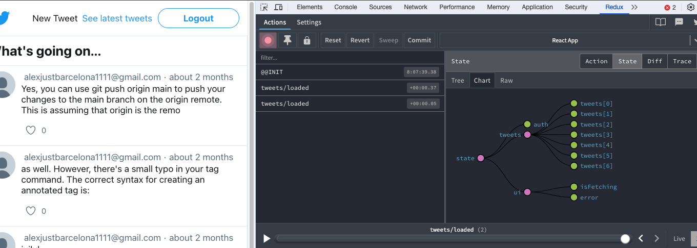

Ya puedes ver el `ui` 

Vamos a llevar la logica al compomponente de `LoginPage.js`

  `const [error, setError] = useState(null);`  
  `const [isFetching, setIsFeching] = useState(false);`  

Esto lo quitas porque lo puedes sacar de Redux. Simplemente te creas un `selector.js`

```js
export const getUi = state => state.ui;
```

Y le pasas este objeto 

  `ui: {`  
    `isFetching: false,`  
    `error: null,`  
  `},`  
  
```js
function LoginPage() {
  const dispatch = useDispatch();
  const { isFetching, error } = useSelector(getUi);
```

Ahora lo que tenías localmente ya lo traes de fuera. Seguimos cambiando las acciones con dispatch
Esto no hace falta

  `const onLogin = () => {`  
    `dispatch(authLoginSuccess());`  
  `};`  


```js

import {
  authLoginFailure,
  authLoginRequest,
  authLoginSuccess,
  uiResetError
} from '../../../store/actions';
import { getUi } from '../../../store/selector';


function LoginPage() {
  const dispatch = useDispatch();
  const { isFetching, error } = useSelector(getUi);

  const [credentials, setCredentials] = useState({
    username: '',
    password: '',
  });
  const location = useLocation();
  const navigate = useNavigate();

  const handleSubmit = async event => {
    event.preventDefault();

    try {
      //setIsFeching(true);
      dispatch(authLoginRequest());
      await login(credentials);
      //setIsFeching(false);
      //onLogin();
      dispatch(authLoginSuccess()); // esto hace las dos cosas
      const to = location?.state?.from?.pathname || '/';
      navigate(to);
    } catch (error) {
      // setIsFeching(false);
      // setError(error);
      dispatch(authLoginFailure(error));
    }
  };

  const resetError = () => {
    dispatch(uiResetError());
  };

```

1:26"


